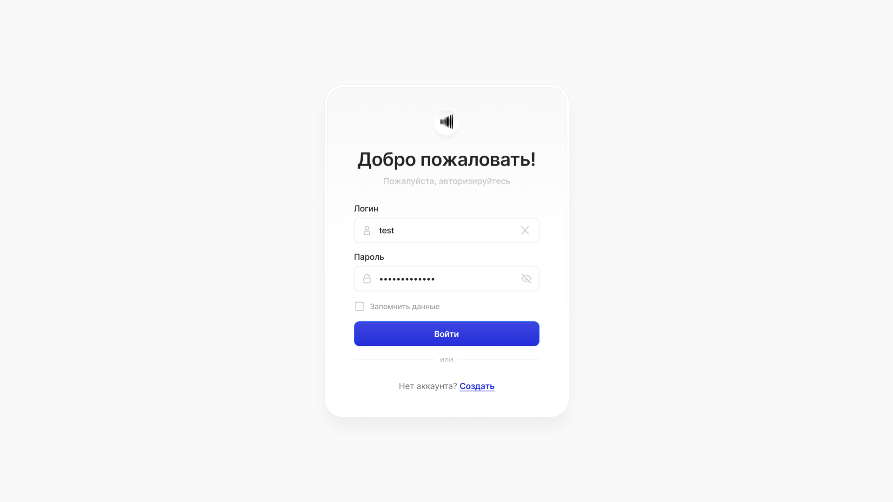
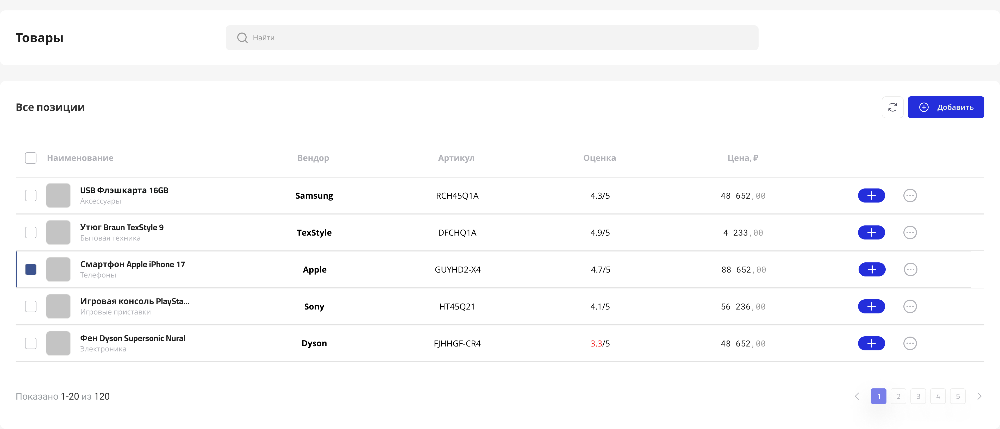

# Тестовое задание для компании Aiti Guru

Посетить: [aiti-guru-dun.vercel.app](https://aiti-guru-dun.vercel.app/)

## Стэк
* React 19
* TypeScript
* Vite
* Scss
* CSS modules
* Redux Toolkit
* React router 7
* Ant Design

## Дизайн

## Api

Как источник данных используется публичный api https://dummyjson.com/

## Требования

Форма входа:
* Валидация полей (обязательность заполнения).
* Обработка ошибок: если API возвращает ошибку, выводить уведомление или текст ошибки под полями.

Логика запоминания данных для входа:
* Если чекбокс установлен, нужно сохранять токен авторизации так, чтобы сессия жила после закрытия браузера
* Если не установлен, то сессия должна сбрасываться при закрытии вкладки

Вывод списка товаров:
* Соответствие столбцам из макета Figma
* Прогресс-бар при подгрузке
* Подгрузка данных из API.

Сортировка:
* Возможность сортировки по столбцам (например, по цене или рейтингу).
* Должно храниться состояние сортировки

Добавление товара:
* По нажатию кнопки "Добавить" открывается форма добавления товара с возможностью заполнить основные поля: Наименование, цена, вендор, артикул.
* При успешном добавлении  показывать базовое Toast уведомление
* Логику сохранения через API делать при этом не нужно.

Логика интерфейса:
* Если рейтинг товара ниже 3, значение должно подсвечиваться красным цветом.

Поиск товаров:
* Использовать API

## Как запустить?
    npm install
    npm run dev
Запускается по адресу http://localhost:5173
